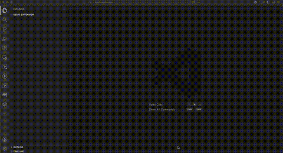

# Prompt Preflight VS Code Extension

Check AI prompts directly inside VS Code before sending them to Codex, Claude, Kiro, Copilot, or another AI agent.

Prompt Preflight can be added to coding-agent tools as a preflight plugin/hook, and it can also be installed as this VS Code extension. The extension is for people and teams who draft prompts in Markdown/XML/TOML files and want feedback before the prompt reaches an AI tool.

Prompt Preflight for VS Code uses the same local Python analyzer as the CLI and coding-agent hooks in the main project. It makes no model calls, uses no API key, and does not send prompt text to a network service.

Author: Arunkumar Ganesan

This extension is available as a public Marketplace beta.

## Install from Marketplace

[Install Prompt Preflight for VS Code](https://marketplace.visualstudio.com/items?itemName=arunkumar-ganesan.prompt-preflight-vscode)

Or install from the command line:

```bash
code --install-extension arunkumar-ganesan.prompt-preflight-vscode
```

After installation, open a Markdown prompt file and click:

```text
🟢 ▶ Run Prompt Preflight Check
```

The Marketplace package bundles the Python analyzer, so normal users do not need to clone the repo or configure `promptPreflight.repoPath`.

## Demo



## Why use it?

AI-agent prompts often live in Markdown notes, team prompt libraries, docs, tickets, or scratch files before they are pasted into a model. This extension helps catch vague or risky prompts earlier, while the prompt is still being written.

It can flag issues such as:

- vague filler like `some task`, `something`, or `blah blah`
- missing context, source material, or target files
- missing output format
- missing success criteria
- risky broad-scope work
- production, migration, destructive, or security-sensitive changes
- likely pasted secrets
- structured prompt templates with required fields left empty or placeholder-only

## Features

- Green CodeLens action above Markdown prompts:

  ```text
  🟢 ▶ Run Prompt Preflight Check
  ```

- Command Palette checks for selected text or the current Markdown document.
- Markdown result reports with intent, Vagueness score, severity, reasons, questions, and suggested prompt.
- One-click suggested prompt insertion back into the original file or selected range.
- Prompt Composer webview for users who prefer filling a form instead of writing template syntax.
- Markdown, XML, and TOML prompt-template creation commands.
- Automatic diagnostics in Markdown, XML, and TOML prompt files.
- Workspace prompt lint for team prompt libraries (see [Team Prompt Libraries](../docs/TEAM_PROMPT_LIBRARIES.md)).
- Team policy template via `.prompt-preflight.json`.
- Local telemetry dashboard with graph-style summaries for prompt checks, block reasons, postflight findings, hosts, daily activity, and token estimates.
- Quick Fix to open the example prompt library.
- Cleanup command for generated result/template/composer tabs.

## Requirements

- VS Code `1.84.0` or newer
- Python `3.10` or newer

For normal VSIX/Marketplace usage, the Python analyzer is bundled inside the extension. Users do not need to clone this repository or set `promptPreflight.repoPath`.

For source development or VSIX packaging, you also need:

- Node.js and npm
- Node.js `20` or newer for VSIX packaging with `@vscode/vsce`

The extension calls the bundled CLI:

```text
bundled-analyzer/scripts/prompt_preflight.py --json
```

During source development, it can also use the main repo checkout.

## Setup from source

From this folder:

```bash
npm install
npm run compile
npm test
```

Open the extension folder in VS Code:

```bash
code "/Users/arunkumarganesan/Documents/Prompt Optimizer/prompt-preflight/vscode-extension"
```

Press `F5`, then choose:

```text
Run Prompt Preflight Extension
```

This launches a VS Code Extension Development Host with Prompt Preflight loaded.

If the Command Palette does not show Prompt Preflight commands, make sure the original VS Code window opened the `vscode-extension` folder itself, not only the repo root.

## Build and install a local VSIX

The VSIX package installs the VS Code extension UI, commands, examples, prompt-template catalog, and Python analyzer.

The extension can find the Python analyzer automatically from:

- a developer override set with `promptPreflight.repoPath`
- the open VS Code workspace if it is the main `prompt-preflight` repo
- a `prompt-preflight/` child folder under the open workspace
- the bundled analyzer inside the installed VSIX

From this folder:

```bash
npm install
npm run package:list
npm run package:vsix
```

Expected:

- `npm run package:list` prints the files that will go into the package.
- `npm run package:vsix` creates a file like:

  ```text
  prompt-preflight-vscode-0.0.1.vsix
  ```

Install the generated package:

```bash
code --install-extension prompt-preflight-vscode-0.0.1.vsix
```

After installation, run:

```text
Prompt Preflight: Check Selected Prompt
```

or open a Markdown file and click:

```text
🟢 ▶ Run Prompt Preflight Check
```

If you see `Could not find Prompt Preflight CLI`, the VSIX installed but the analyzer could not be resolved. For Marketplace/VSIX users, that usually means the bundled analyzer was not packaged correctly; reinstall the extension and run:

```text
Prompt Preflight: Run Setup Doctor
```

## Optional developer repo path

During development inside this repo, the extension automatically resolves the main repo path as the parent folder of `vscode-extension`. Installed VSIX users normally do not need `repoPath` because the analyzer is bundled.

If you are developing analyzer changes from another checkout and want the extension to use that checkout instead of the bundled analyzer, set:

```json
{
  "promptPreflight.repoPath": "/path/to/prompt-preflight"
}
```

Optional settings:

```json
{
  "promptPreflight.pythonPath": "python3",
  "promptPreflight.threshold": 45,
  "promptPreflight.maxQuestions": 3,
  "promptPreflight.diagnostics.enabled": true,
  "promptPreflight.diagnostics.debounceMs": 900
}
```

## Local telemetry dashboard

Telemetry stays on the user machine. The VS Code extension reads the same local
JSONL file used by the CLI, Codex hook, Claude Code hook, and Kiro hook. It does
not send telemetry to a server and does not store prompt text or response text.

Enable telemetry with:

```text
Prompt Preflight: Enable Local Telemetry
```

That command creates or updates `.prompt-preflight.json` with:

```json
{
  "telemetry": {
    "enabled": true,
    "path": ".prompt-preflight-telemetry.jsonl"
  },
  "token_observability": {
    "enabled": true,
    "default_max_output_tokens": 1000,
    "estimated_retry_output_tokens": 800
  }
}
```

After that:

1. Run normal prompt checks from VS Code, Codex, Claude Code, Kiro, or the CLI.
2. Open the Command Palette.
3. Run:

   ```text
   Prompt Preflight: Open Telemetry Dashboard
   ```

The dashboard shows:

- prompt checks, blocks, nudges, bypasses, and allowed prompts
- top checks causing blocked prompts
- postflight response checks when postflight telemetry exists
- host breakdown across VS Code, Codex, Claude Code, Kiro, and CLI
- daily local activity
- estimated request tokens, response tokens, token-risk buckets, and avoided retry token opportunity

The graph uses local estimates. It is useful for spotting cost-risk trends, but
it is not a replacement for provider billing dashboards.

## Quick start

1. Open or create a Markdown file.
2. Type a vague prompt:

   ```text
   Create a car image
   ```

3. Click:

   ```text
   🟢 ▶ Run Prompt Preflight Check
   ```

Expected result:

- A warning notification says the prompt needs clarification.
- A Markdown result opens beside the editor.
- The result shows a Vagueness score, reasons, questions, and a suggested prompt.
- The suggested prompt can be inserted back into the original file when the result is linked to a file or selection.

Try a clearer prompt:

```text
Create a photorealistic 16:9 image of a red 1967 Ford Mustang parked on a rainy Tokyo street at night, with neon reflections, low camera angle, cinematic lighting, and no people.
```

Expected result:

- Prompt Preflight reports `Clear to send`.

## Commands

Open the Command Palette with `Cmd+Shift+P` on macOS or `Ctrl+Shift+P` on Windows/Linux.

| Command | What it does |
| --- | --- |
| `Prompt Preflight: Check Selected Prompt` | Checks selected editor text, or asks for pasted text if nothing is selected. |
| `Prompt Preflight: Check Current Markdown Prompt` | Checks the current Markdown document. |
| `Prompt Preflight: Insert Suggested Prompt into Original File` | Applies a result document’s suggested prompt back to the source file or selected range. |
| `Prompt Preflight: Close Generated Tabs` | Closes generated Prompt Preflight result, template, policy, and composer prompt tabs. |
| `Prompt Preflight: New Markdown Prompt Template` | Opens a new Markdown prompt-template document. |
| `Prompt Preflight: New XML Prompt Template` | Opens a new XML prompt-template document. |
| `Prompt Preflight: New TOML Prompt Template` | Opens a new TOML prompt-template document. |
| `Prompt Preflight: Open Prompt Examples` | Opens the shared vague-prompt examples file. |
| `Prompt Preflight: Lint Workspace Prompt Files` | Checks marked prompt files in the workspace. |
| `Prompt Preflight: Create .prompt-preflight.json` | Creates the workspace policy file from the default template and opens it. |
| `Prompt Preflight: Enable Local Telemetry` | Creates or updates the workspace policy so `telemetry.enabled` is `true`. |
| `Prompt Preflight: Open Team Policy` | Opens an existing policy file, or opens an untitled policy template when one does not exist. |
| `Prompt Preflight: Open Prompt Composer` | Opens the form-based prompt composer. |
| `Prompt Preflight: Open Telemetry Dashboard` | Opens local telemetry graphs and token-estimate summaries. |
| `Prompt Preflight: Run Setup Doctor` | Opens a setup report for repo path, Python path, duplicate extensions, and telemetry policy. |
| `Prompt Preflight: Open Release Readiness Checklist` | Opens the public-release gate checklist. |

If you use `Cmd+P` instead of `Cmd+Shift+P`, type `>` first:

```text
>Prompt Preflight: Check Selected Prompt
```

Without `>`, VS Code searches files instead of commands.

## Prompt Composer

Run:

```text
Prompt Preflight: Open Prompt Composer
```

The composer lets users fill these fields:

- Profile
- Task
- Context
- Output format
- Success criteria
- Constraints
- Examples

The preview updates live and starts with:

```md
<!-- prompt-preflight: check -->
```

That marker opts saved prompt files into workspace lint.

Constraints are profile-aware:

- `General`, `Image generation`, `Writing`, `Research`, `Data analysis`, and `Presentation` treat constraints as optional.
- `Software / agent work` treats constraints as required because agent changes need boundaries like what to preserve and what not to touch.

Empty optional fields are omitted from generated Markdown so placeholder text does not accidentally satisfy the analyzer.

Composer actions:

- `Create Markdown file`
- `Run Prompt Preflight`
- `Copy prompt`

## Suggested prompt insertion

When a result document is produced from a real file or selected range, the result can show:

```text
➡ Insert suggested prompt into original file
```

Clicking it replaces the original vague prompt with the suggested prompt or template.

If you checked pasted input from an input box, there is no source file to update. In that case, copy the suggested prompt manually.

## Generated tab cleanup

Prompt Preflight can open temporary tabs for result reports, templates, policy files, and composer-created prompt files.

Use either:

```text
Prompt Preflight: Close Generated Tabs
```

or the CodeLens shown in generated Prompt Preflight tabs:

```text
🧹 Close Prompt Preflight generated tabs
```

The cleanup command only targets tabs opened by Prompt Preflight during the current extension session. Normal workspace files are left alone.

## Structured prompt templates

Template commands open new untitled documents. They intentionally do not insert into the active editor because the active editor might be source code.

Available formats:

- Markdown
- XML
- TOML

Available profiles come from the shared catalog in:

```text
src/prompt_preflight/data/prompt_templates.json
```

Examples:

```text
Prompt Preflight: New Markdown Prompt Template
Prompt Preflight: New XML Prompt Template
Prompt Preflight: New TOML Prompt Template
```

Pick a profile such as:

- General prompt contract
- Software / agent work contract
- Image generation contract
- Writing contract
- Research contract
- Data analysis contract
- Presentation contract

## Inline diagnostics

Prompt Preflight can show warnings in prompt-like files while you type.

Diagnostics run for:

- Markdown
- XML
- TOML

Diagnostics skip:

- source-code languages such as TypeScript
- generated Prompt Preflight result documents
- documentation files such as `README.md` and `docs/EXAMPLES.md`
- very large documents

Prompt Preflight diagnostics use the source:

```text
Prompt Preflight
```

If the Problems panel shows `cSpell` unknown-word entries, those are from the Spell Checker extension, not Prompt Preflight.

Disable diagnostics:

```json
{
  "promptPreflight.diagnostics.enabled": false
}
```

Change debounce timing:

```json
{
  "promptPreflight.diagnostics.debounceMs": 900
}
```

## Workspace prompt lint

Workspace lint is opt-in. Add this marker near the top of each prompt file that should be checked:

```md
<!-- prompt-preflight: check -->
```

For TOML:

```toml
# prompt-preflight: check
```

For XML:

```xml
<!-- prompt-preflight: check -->
```

Then run:

```text
Prompt Preflight: Lint Workspace Prompt Files
```

The linter checks marked `*.md`, `*.xml`, and `*.toml` files, reports failures in the Problems panel, and writes a summary to the `Prompt Preflight` output channel.

## Team policy

To create the policy file directly in your workspace root, run:

```text
Prompt Preflight: Create .prompt-preflight.json
```

If `.prompt-preflight.json` already exists, the command opens the existing file and does not overwrite it.

To create or update the policy file with local telemetry enabled, run:

```text
Prompt Preflight: Enable Local Telemetry
```

To open an existing policy or preview the template without writing a file, run:

```text
Prompt Preflight: Open Team Policy
```

If `.prompt-preflight.json` exists in the workspace root, it opens. Otherwise, the extension opens a default untitled JSON policy template.

Example policy:

```json
{
  "enabled": true,
  "mode": "block",
  "threshold": 45,
  "max_questions": 3,
  "checks": {
    "clarity": "nudge",
    "context": "nudge",
    "output_contract": "nudge",
    "template_contract": "block",
    "risk": "block",
    "plan_first": "block",
    "privacy": "block"
  }
}
```

The same policy shape is used by the CLI, Codex plugin, Claude Code plugin, and Kiro hook.

## Development

Useful commands:

```bash
npm run compile
npm run watch
npm run check
npm test
```

Run the full repo tests from the main repo root:

```bash
python3 -m unittest discover -s tests -q
```

## Manual UAT checklist

Use this checklist in the Extension Development Host.

### Check a vague Markdown prompt

1. Create `testprompt.md`.
2. Add:

   ```text
   Create a car image
   ```

3. Click `🟢 ▶ Run Prompt Preflight Check`.

Expected:

- A result tab opens.
- The result includes a non-zero Vagueness score.
- The Questions section stands out visually.
- The suggested prompt is domain-specific to image generation.
- A cleanup CodeLens appears at the top of the result tab.

### Insert a suggested prompt

1. Run a check from a Markdown file or selected range.
2. In the result tab, click:

   ```text
   ➡ Insert suggested prompt into original file
   ```

Expected:

- VS Code returns to the original file.
- The vague prompt is replaced.
- If only a range was selected, only that range is replaced.

### Test filler answers in the composer

Open the composer and enter filler values such as:

```text
Task: some task
Context: something
Output format: someth format
Success criteria: some
```

Expected:

- Prompt Preflight does not treat these as meaningful required fields.
- The result asks for concrete task, context, output format, and success criteria.

### Close generated tabs

After opening one or more result/template/composer tabs, run:

```text
Prompt Preflight: Close Generated Tabs
```

Expected:

- Generated Prompt Preflight tabs close.
- Normal workspace files remain open.

### Run setup doctor

Run:

```text
Prompt Preflight: Run Setup Doctor
```

Expected:

- A Markdown setup report opens.
- The report shows whether the Python analyzer was found.
- The report warns if an installed VSIX copy can collide with Extension Development Host.
- The report shows whether `.prompt-preflight.json` exists and whether telemetry is enabled.

## Troubleshooting

### Command Palette says “No matching results”

Make sure you opened the Command Palette, not Quick Open.

Use:

```text
Cmd+Shift+P
```

Or type this into `Cmd+P`:

```text
>Prompt Preflight
```

If commands still do not appear:

1. Close the Extension Development Host.
2. Open this folder in the original VS Code window:

   ```text
   /Users/arunkumarganesan/Documents/Prompt Optimizer/prompt-preflight/vscode-extension
   ```

3. Run:

   ```bash
   npm run compile
   ```

4. Press `F5`.
5. Choose `Run Prompt Preflight Extension`.

### The green CodeLens does not appear

Check:

1. The file language mode is `Markdown`.
2. The file is not empty.
3. VS Code setting `Editor › Code Lens` is enabled.
4. The Extension Development Host has been reloaded after compiling.

### The analyzer CLI cannot be found

Installed VSIX users should not need `promptPreflight.repoPath`; the analyzer is bundled. First run:

```text
Prompt Preflight: Run Setup Doctor
```

If you are developing from source or intentionally testing a different checkout, set:

```json
{
  "promptPreflight.repoPath": "/path/to/prompt-preflight"
}
```

The override path should point to the main repo checkout that contains:

```text
scripts/prompt_preflight.py
```

It lists every CLI path the extension checked.

### Cannot register `promptPreflight.threshold`

This usually means an installed Prompt Preflight extension is colliding with the
Extension Development Host. Run:

```bash
code --uninstall-extension akg268.prompt-preflight-vscode
code --uninstall-extension arunkumar-ganesan.prompt-preflight-vscode
```

Then close all VS Code windows and launch the Extension Development Host again
from the `vscode-extension` folder.

### Python cannot run

Set:

```json
{
  "promptPreflight.pythonPath": "/path/to/python3"
}
```

## Packaging status

Local VSIX packaging is supported with:

```bash
npm run package:vsix
npm run package:audit
```

From the repo root, maintainers can run the full automated release gate:

```bash
python3 scripts/release_check.py
```

That command builds a fresh temporary VSIX, audits its contents, installs it into a clean temporary VS Code profile, and verifies the extension ID.

Marketplace publishing is not set up yet. Before publishing to the Marketplace, the project still needs publisher-token setup, Marketplace account verification, release workflow decisions, and final install-from-VSIX/manual UAT on a clean machine.

Before publishing or broadly announcing, run:

```text
Prompt Preflight: Open Release Readiness Checklist
```

The same checklist is committed at
[`docs/RELEASE_READINESS.md`](../docs/RELEASE_READINESS.md).
